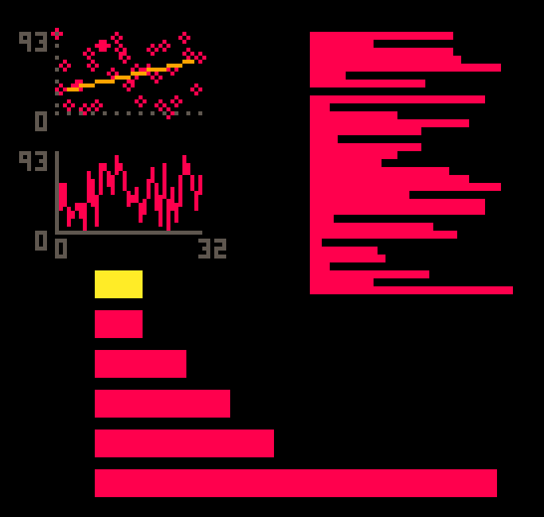

# PICO8 Plots



## Usage

The example above was generated from the following code:


```lua
xs, ys = {}, {}

for x=0,32 do
 add(xs, x)
 add(ys, flr(rnd(100)))
end

y0,y1 = minmax(ys)

function _draw()
 cls()
 local ax = make_ax(
   10,10,36,20)
 color(8)
 plot(xs,ys,ax,function(x,y)circ(x,y,1)end)
 color(5)
 draw_ax(ax,0,0,3)
 yticks(ax)
 color(9)
 plot({3,30},{30,60},ax)

 ax = make_ax(
   10,40,36,20)
 color(8)
 plot(xs,ys,ax)
 color(5)
 draw_ax(ax,0,0)
 xticks(ax)
 yticks(ax)

 color(8)
 ax = make_ax(
   74,10,50)
 hbar(ys,ax,1,1)

 ax = make_ax(
   20,70,100)
 cards = {1,9,4,3,2,1,0}
 hbar(cards,ax,6,4)
 cards = {0,0,0,0,0,0,1}
 color(10)
 hbar(cards,ax,6,4)
end
```

## Limitations

This library is pretty half-baked, as it overran the number of tokens I had left
in the intended cart. It may work well for simple cases but don't expect
publication quality.
